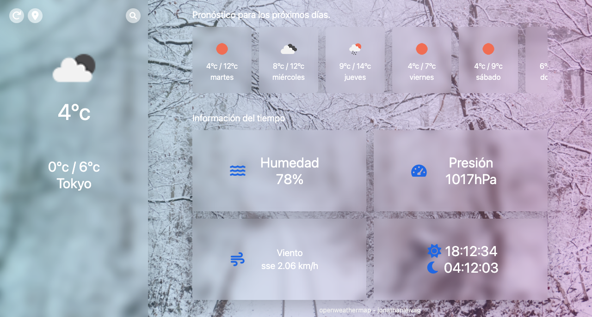

# Open weather map



Es un programa para ver el clima en diferente parte del mundo, haciendo un filtrado por ciudad

- [Tailwind css](https://tailwindcss.com/)
- [Javascript](https://developer.mozilla.org/es/docs/Web/JavaScript)
- [VUE.js](https://vuejs.org/)
- [Open weather map api](https://openweathermap.org/)
- [unsplash](https://unsplash.com/)
- [sweetalert2](https://sweetalert2.github.io/)
- [vite](https://vitejs.dev/)

## Instalación

Template Requiere
[Node.js](https://nodejs.org/),
[NPM](https://nodejs.org/) o [yarn](https://yarnpkg.com/),
[Chrome](https://www.google.com/intl/es-419/chrome/)

Instale las dependencias y dependencias de desarrollo.

```sh
cd openweathermap
npm i o yarn
```

.env

```sh
# Access Key de unsplash
VITE_CLIENT_ID=

# api key de openweathermap
VITE_API_WEATHER=
```

## Comandos

Tiene un listado de comando para realizar

| Comandos           | Descripción                                           |
| ------------------ | ----------------------------------------------------- |
| npm run dev:server | Crear un servidor de desarrollo                       |
| npm run dev:css    | Crear un servidor de desarrollo de css                |
| npm run build      | Crear los archivos necesario para producción (./dist) |

> Notas:

> Todos los resultados que tiene este Software vienen directamente de openweathermap.

> Las imágenes vienen directamente de unsplash, son imágenes random según la descripción de los resultados de openweathermap (puede salir imágenes sensibles)

# License

Usar este programas para aprender, no lo utilice como página para ver el clima. MIT

Free Software, Hell Yeah!
